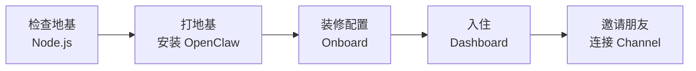
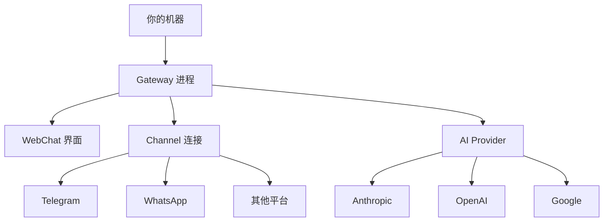

# 5 分钟快速安装指南

> 使用费曼学习法，让新手也能快速上手 OpenClaw。

---

## 第一步：概念解释

### 安装 OpenClaw 需要什么？

**核心要求（3 样东西）：**

| 要求 | 具体说明 | 检查命令 |
|------|---------|---------|
| **Node.js** | 版本 24（推荐）或 22.14+ | `node --version` |
| **API Key** | 来自 AI 提供商（Anthropic/OpenAI/Google 等） | - |
| **5 分钟** | 安装 + 配置 + 测试 | - |

**就这么简单！** 不需要复杂的环境，不需要数据库，不需要额外的服务器。

---

## 第二步：类比理解

### 把安装过程想象成"装修新房子"



| 步骤 | 装修类比 | 实际操作 |
|------|---------|---------|
| 检查地基 | 确认房子结构稳固 | 确认 Node.js 版本 |
| 打地基 | 建好房子主体 | 安装 OpenClaw |
| 装修配置 | 设计房间布局 | 设置 API Key |
| 入住 | 打开房门 | 打开 Dashboard |
| 邀请朋友 | 开派对 | 连接聊天平台 |

---

## 第三步：实践示例

### 方法一：一键安装（推荐）

**macOS / Linux：**
```bash
curl -fsSL https://openclaw.ai/install.sh | bash
```

**Windows (PowerShell)：**
```powershell
iwr -useb https://openclaw.ai/install.ps1 | iex
```

### 方法二：npm 安装

```bash
npm install -g openclaw@latest
```

### 方法三：Docker 安装

```bash
docker pull openclaw/openclaw:latest
docker run -p 18789:18789 openclaw/openclaw
```

---

### 配置步骤（Onboard）

```bash
# 运行配置向导
openclaw onboard --install-daemon
```

**向导会问这些问题：**

| 问题 | 说明 | 建议回答 |
|------|------|---------|
| 选择 AI 模型 | Anthropic/OpenAI/Google 等 | 根据你有的 API Key |
| 输入 API Key | 你的密钥 | 复制粘贴 |
| 是否安装服务 | 后台运行 | 选 `yes` |
| 默认 workspace | 工作目录 | 默认即可 |

---

### 验证安装

```bash
# 1. 检查 Gateway 是否运行
openclaw gateway status

# 预期输出：
# Runtime: running
# RPC probe: ok
# Port: 18789

# 2. 打开控制面板
openclaw dashboard

# 会在浏览器打开 http://127.0.0.1:18789
```

---

### 发送第一条消息

**方法一：浏览器 WebChat**
- 打开 Dashboard
- 在聊天框输入消息
- 等待 AI 回复

**方法二：连接 Telegram（最快）**

1. 创建 Telegram Bot（找 @BotFather）
2. 获取 Bot Token
3. 配置：

```bash
openclaw config set channels.telegram.botToken "你的token"
openclaw config set channels.telegram.enabled true
```

---

## 第四步：知识关联

### 安装后的架构



### 与其他组件的关系

| 组件 | 安装后的作用 |
|------|------------|
| **Gateway** | 核心服务，已自动启动 |
| **Config** | `~/.openclaw/openclaw.json` 配置文件 |
| **State** | `~/.openclaw/` 状态目录 |
| **Workspace** | Agent 工作目录 |

---

## 常见问题

### Q1: Node 版本不对怎么办？

```bash
# 推荐使用 nvm 管理 Node 版本
nvm install 24
nvm use 24
```

### Q2: Windows 用户用 WSL2 还是 PowerShell？

| 方式 | 推荐度 | 说明 |
|------|-------|------|
| **WSL2** | ⭐⭐⭐ 推荐 | 稳定性好，体验完整 |
| PowerShell | ⭐⭐ 可用 | 基本功能可用 |

### Q3: 没有 API Key 怎么办？

**获取 API Key 的途径：**

| Provider | 获取链接 | 价格 |
|----------|---------|------|
| Anthropic | console.anthropic.com | 按用量付费 |
| OpenAI | platform.openai.com | 按用量付费 |
| Google | aistudio.google.com | 有免费额度 |
| OpenRouter | openrouter.ai | 多模型聚合 |

### Q4: 安装失败怎么办？

```bash
# 运行诊断
openclaw doctor

# 查看日志
openclaw logs --follow
```

---

## 平台特定说明

### macOS

```bash
# 安装后 Gateway 会自动启动
# 可以在菜单栏看到 OpenClaw 图标

# 常用命令
openclaw gateway status
openclaw dashboard
```

### Linux

```bash
# 使用 systemd 管理
openclaw gateway install
systemctl --user enable --now openclaw-gateway.service

# 查看状态
openclaw gateway status
```

### Windows

```powershell
# 安装为启动项
openclaw gateway install

# 查看状态
openclaw gateway status --json
```

---

## 下一步

安装完成后，建议：

1. ✅ 阅读 [配置指南](./02-配置指南.md) 了解定制化选项
2. ✅ 连接一个 [Channel](./05-Channels通道.md) 在手机上聊天
3. ✅ 了解 [Skills](./03-Skills技能.md) 扩展 Agent 能力

---

> 最后更新：2026-04-10 | 来源：https://docs.openclaw.ai/start/getting-started