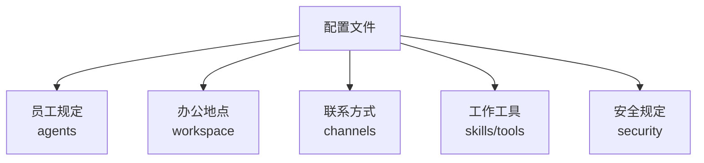
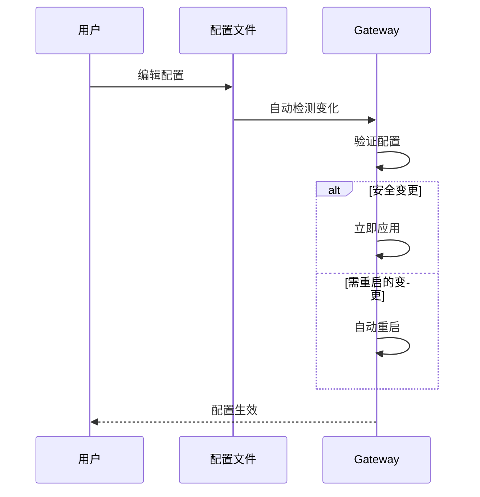

# OpenClaw 配置指南

> 配置文件是 OpenClaw 的"大脑"，决定了 Agent 如何工作。

---

## 第一步：概念解释

### 配置文件是什么？

**用最简单的话说：** 配置文件是一张"说明书"，告诉 OpenClaw：
- 用哪个 AI 模型
- 连接哪些聊天平台
- 谁可以和 Agent 聊天
- Agent 能做什么

### 配置文件位置

```
~/.openclaw/openclaw.json
```

**格式：** JSON5（支持注释和尾随逗号，更友好）

---

## 第二步：类比理解

### 把配置文件想象成"公司规章"



| 配置部分 | 类比 | 实际作用 |
|---------|------|---------|
| `agents` | 员工手册 | Agent 身份和行为 |
| `channels` | 电话/邮箱 | 聊天平台连接 |
| `gateway` | 公司大门 | 网关设置 |
| `session` | 会议规则 | 会话管理 |
| `skills` | 技能证书 | Agent 能力 |

---

## 第三步：实践示例

### 最简配置（什么都不配）

```json5
// 空文件也行！OpenClaw 有默认设置
{}
```

### 基础配置示例

```json5
// ~/.openclaw/openclaw.json
{
  // 设置工作目录
  agents: {
    defaults: {
      workspace: "~/.openclaw/workspace",
    },
  },
  
  // 连接 WhatsApp，只允许特定号码
  channels: {
    whatsapp: {
      enabled: true,
      allowFrom: ["+15555550123"],  // 你的号码
    },
  },
}
```

### 完整配置示例

```json5
{
  // Agent 设置
  agents: {
    defaults: {
      workspace: "~/.openclaw/workspace",
      model: {
        primary: "anthropic/claude-sonnet-4-6",
        fallbacks: ["openai/gpt-5.4"],
      },
      skills: ["github", "weather"],  // 允许的技能
    },
    list: [
      { id: "main", default: true },
      { id: "docs", skills: ["docs-search"] },
    ],
  },
  
  // Channel 设置
  channels: {
    telegram: {
      enabled: true,
      botToken: "你的bot_token",
      dmPolicy: "pairing",  // 新用户需要配对
    },
    whatsapp: {
      enabled: true,
      allowFrom: ["+15555550123"],
      groups: { "*": { requireMention: true } },
    },
  },
  
  // Gateway 设置
  gateway: {
    port: 18789,
    auth: {
      token: "your_secret_token",
    },
  },
  
  // 会话设置
  session: {
    dmScope: "per-channel-peer",  // 每个用户独立会话
    reset: {
      mode: "daily",
      atHour: 4,
    },
  },
}
```

---

### 编辑配置的方式

| 方式 | 命令/操作 | 适用场景 |
|------|---------|---------|
| **向导** | `openclaw onboard` | 新手首次配置 |
| **CLI** | `openclaw config set/get` | 快速改单项 |
| **浏览器** | Dashboard → Config | 可视化编辑 |
| **直接编辑** | 编辑 `openclaw.json` | 批量修改 |

**CLI 示例：**

```bash
# 查看配置项
openclaw config get agents.defaults.workspace

# 设置配置项
openclaw config set channels.telegram.enabled true
openclaw config set agents.defaults.model.primary "anthropic/claude-sonnet-4-6"

# 删除配置项
openclaw config unset channels.whatsapp.allowFrom
```

---

## 第四步：知识关联

### 配置热重载



**热重载模式：**

| 模式 | 行为 | 说明 |
|------|------|------|
| `hybrid`（默认） | 安全变更立即生效，需重启的自动重启 | 推荐 |
| `hot` | 只应用安全变更，需重启的警告 | 手动控制 |
| `restart` | 任何变更都重启 | 保守模式 |
| `off` | 不监听配置文件 | 完全手动 |

---

### 关键配置项一览

#### agents（Agent 设置）

| 字段 | 说明 | 示例 |
|------|------|------|
| `workspace` | 工作目录 | `"~/.openclaw/workspace"` |
| `model.primary` | 主模型 | `"anthropic/claude-sonnet-4-6"` |
| `model.fallbacks` | 备用模型 | `["openai/gpt-5.4"]` |
| `skills` | 允许的技能 | `["github", "weather"]` |
| `sandbox` | 沙箱设置 | `{ mode: "non-main" }` |

#### channels（通道设置）

| 字段 | 说明 | 示例 |
|------|------|------|
| `enabled` | 是否启用 | `true` |
| `dmPolicy` | DM 访问策略 | `"pairing"` / `"allowlist"` / `"open"` |
| `allowFrom` | 允许的发送者 | `["+15555550123"]` |
| `groups` | 群组设置 | `{ "*": { requireMention: true } }` |

#### gateway（网关设置）

| 字段 | 说明 | 示例 |
|------|------|------|
| `port` | 监听端口 | `18789` |
| `auth.token` | 认证令牌 | `"your_token"` |
| `bind` | 绑定模式 | `"loopback"` / `"all"` |

---

## 常见配置场景

### 场景一：只允许特定用户

```json5
{
  channels: {
    telegram: {
      dmPolicy: "allowlist",
      allowFrom: ["tg:123456789"],
    },
  },
}
```

### 场景二：群聊必须提及

```json5
{
  agents: {
    list: [{
      id: "main",
      groupChat: {
        mentionPatterns: ["@openclaw", "openclaw"],
      },
    }],
  },
  channels: {
    whatsapp: {
      groups: { "*": { requireMention: true } },
    },
  },
}
```

### 场景三：多个 Agent

```json5
{
  agents: {
    list: [
      { id: "home", default: true, workspace: "~/.openclaw/home" },
      { id: "work", workspace: "~/.openclaw/work" },
    ],
  },
  bindings: [
    { agentId: "home", match: { channel: "whatsapp" } },
    { agentId: "work", match: { channel: "telegram" } },
  ],
}
```

### 场景四：环境变量注入

```json5
{
  env: {
    OPENROUTER_API_KEY: "sk-or-...",
    vars: { GROQ_API_KEY: "gsk-..." },
  },
}
```

---

## 安全提醒

⚠️ **配置验证严格：**
- 不认识的字段 → 启动失败
- 类型错误 → 启动失败
- 值不合法 → 启动失败

**遇到错误时：**

```bash
# 运行诊断
openclaw doctor

# 自动修复
openclaw doctor --fix
```

---

## 下一步

1. ✅ 阅读 [Skills 技能](./03-Skills技能.md) 扩展能力
2. ✅ 查看 [配置参考](https://docs.openclaw.ai/gateway/configuration-reference) 了解所有字段
3. ✅ 使用 [配置示例](https://docs.openclaw.ai/gateway/configuration-examples) 快速上手

---

> 最后更新：2026-04-10 | 来源：https://docs.openclaw.ai/gateway/configuration