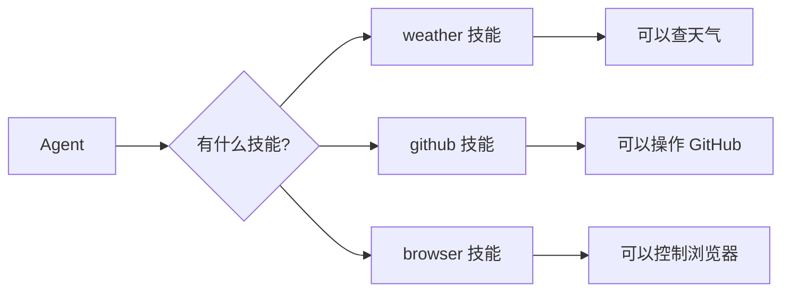

# OpenClaw Skills 技能系统

> Skills 是 Agent 的"技能证书"，决定了 Agent 能做什么。

---

## 第一步：概念解释

### 什么是 Skill？

**用最简单的话说：** Skill 是一个"教学文档"，教 Agent 如何使用某个工具。

就像给新员工发一本"操作手册"，告诉他：
- 这个工具是什么
- 什么时候用
- 怎么用

### Skill 文件结构

```
skills/
└── weather/
    └── SKILL.md       # 技能说明文件（必须）
```

**SKILL.md 内容：**

```markdown
---
name: weather
description: Get current weather and forecasts
---

# Weather Skill

Use this skill when user asks about weather...
```

---

## 第二步：类比理解

### 把 Skills 想象成"职业技能证书"



| 类比 | 实际 |
|------|------|
| **证书目录** | `skills/` 文件夹 |
| **证书文件** | `SKILL.md` |
| **证书内容** | YAML frontmatter + 说明文档 |
| **获得证书** | 安装 Skill |
| **吊销证书** | 禁用 Skill |

---

## 第三步：实践示例

### Skill 的加载位置

**按优先级排序（高到低）：**

| 位置 | 说明 | 适用场景 |
|------|------|---------|
| `<workspace>/skills/` | 工作区技能 | 项目特定技能 |
| `<workspace>/.agents/skills/` | 项目 Agent 技能 | 项目内 Agent 共享 |
| `~/.agents/skills/` | 个人 Agent 技能 | 跨项目 Agent 共享 |
| `~/.openclaw/skills/` | 管理技能 | 所有 Agent 共享 |
| **bundled skills** | 内置技能 | 默认自带 |
| `skills.load.extraDirs` | 额外目录 | 自定义位置 |

### 使用内置 Skills

OpenClaw 内置了很多 Skills：

| Skill | 功能 | 触发词 |
|-------|------|--------|
| `weather` | 查天气 | "天气"、"weather" |
| `github` | GitHub 操作 | "PR"、"issue" |
| `browser` | 浏览器控制 | "打开网页"、"click" |
| `web-search` | 网络搜索 | "搜索"、"search" |
| `coding-agent` | 编码任务 | "写代码"、"refactor" |

### 从 ClawHub 安装 Skill

```bash
# 搜索技能
openclaw skills search <skill-name>

# 安装技能
openclaw skills install <skill-slug>

# 更新所有技能
openclaw skills update --all
```

### 配置 Skills

```json5
// ~/.openclaw/openclaw.json
{
  agents: {
    defaults: {
      skills: ["github", "weather"],  // 默认允许这些
    },
    list: [
      { id: "writer" },  // 继承默认技能
      { id: "docs", skills: ["docs-search"] },  // 替换默认
      { id: "locked", skills: [] },  // 无技能
    ],
  },
}
```

### Skill 配置项

```json5
{
  skills: {
    entries: {
      "image-lab": {
        enabled: true,
        apiKey: "your_api_key",
        env: {
          GEMINI_API_KEY: "GEMINI_KEY",
        },
        config: {
          endpoint: "https://example.com",
          model: "nano-pro",
        },
      },
    },
  },
}
```

---

## 第四步：知识关联

### Skills 与其他概念的关系

```mermaid
graph TD
    A[Skills] --> B[Tools 工具]
    A --> C[Plugins 插件]
    A --> D[Slash Commands]
    
    B --> B1[exec]
    B --> B2[web-search]
    B --> B3[browser]
    
    C --> C1[MCP 协议]
    C --> C2[外部服务]
    
    D --> D1[/weather]
    D --> D2[/github]
```

### Skill 的 Gate 机制

Skill 可以设置"门槛"，只有满足条件才加载：

```markdown
---
name: gemini
metadata:
  {
    "openclaw": {
      "requires": {
        "bins": ["gemini"],        # 需要这个命令存在
        "env": ["GEMINI_API_KEY"], # 需要这个环境变量
        "config": ["browser.enabled"]  # 需要配置项为 true
      }
    }
  }
---
```

| Gate 类型 | 说明 |
|----------|------|
| `bins` | 需要可执行文件 |
| `env` | 需要环境变量 |
| `config` | 需要配置项 |
| `os` | 限制操作系统 |

---

## 创建自定义 Skill

### 最简 Skill

```markdown
---
name: my-skill
description: My custom skill
---

# My Skill

Use this skill when user says "my-command".

Steps:
1. Read the file
2. Process the content
3. Return the result
```

### Skill 模板字段

| 字段 | 必须 | 说明 |
|------|------|------|
| `name` | ✅ | Skill 名称 |
| `description` | ✅ | 简短描述 |
| `metadata` | ❌ | OpenClaw 元数据 |
| `homepage` | ❌ | 网站 URL |
| `user-invocable` | ❌ | 是否用户可调用（默认 true） |

---

## ClawHub 技能市场

### 搜索和发现

- **网址：** https://clawhub.ai
- **CLI：** `openclaw skills search`

### 发布技能

```bash
# 使用 clawhub CLI
clawhub sync --all
```

---

## 安全注意事项

⚠️ **Skills 是代码！**
- 第三方 Skill 可能包含危险操作
- 安装前先阅读 SKILL.md
- 使用 sandbox 隔离风险

```json5
{
  agents: {
    defaults: {
      sandbox: { mode: "non-main" },  // 非主会话使用沙箱
    },
  },
}
```

---

## 常见问题

### Q1: Skill 不生效？

检查：
1. `SKILL.md` 是否存在
2. frontmatter 格式是否正确
3. Gate 条件是否满足
4. 是否在 `agents.defaults.skills` 中

### Q2: 如何调试 Skill？

```bash
# 查看 Gateway 状态
openclaw gateway status

# 查看日志
openclaw logs --follow

# 查看可用 slash commands
openclaw skills list
```

### Q3: Skill Token 消耗？

**公式：**
```
总字符 = 195 + Σ(97 + name长度 + description长度)
```

大约每个 Skill ≈ 24 tokens（加上名称描述）

---

## 下一步

1. ✅ 浏览 [ClawHub](https://clawhub.ai) 发现更多技能
2. ✅ 学习 [创建 Skills](https://docs.openclaw.ai/tools/creating-skills)
3. ✅ 了解 [MCP 协议](./04-MCP协议.md) 作为替代方案

---

> 最后更新：2026-04-10 | 来源：https://docs.openclaw.ai/tools/skills