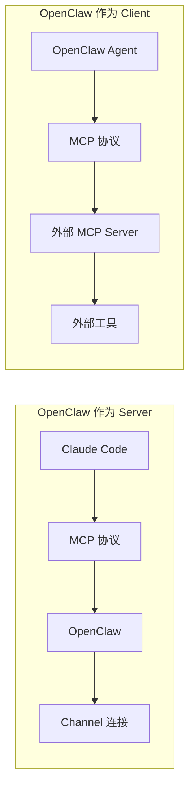
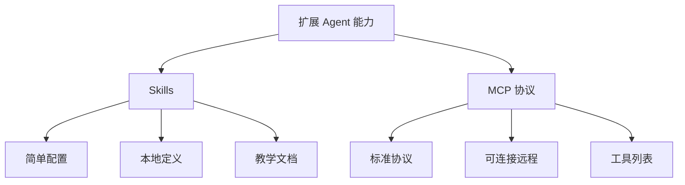

# OpenClaw MCP 协议支持

> MCP 是 Agent 与外部工具的"通用语言"。

---

## 第一步：概念解释

### 什么是 MCP？

**用最简单的话说：** MCP（Model Context Protocol）是一个"标准接口"，让 Agent 能和各种外部工具对话。

就像 USB 接口：
- USB 是标准 → 各种设备都能连接电脑
- MCP 是标准 → 各种工具都能连接 Agent

### MCP 的两种角色

| 角色 | OpenClaw 的作用 | 类比 |
|------|----------------|------|
| **MCP Server** | 提供工具给其他应用 | "服务员" |
| **MCP Client** | 使用其他 MCP Server 的工具 | "顾客" |

---

## 第二步：类比理解

### 把 MCP 想象成"餐厅点餐系统"



| 类比 | MCP 角色 | 实际作用 |
|------|---------|---------|
| **餐厅服务员** | MCP Server | 接单、上菜（提供工具） |
| **顾客** | MCP Client | 点餐（使用工具） |
| **菜单** | Tools List | 可用的工具列表 |
| **点餐单** | Tool Call | 调用具体工具 |
| **菜品** | Tool Result | 工具返回结果 |

---

## 第三步：实践示例

### OpenClaw 作为 MCP Server

**用途：** 让其他应用（如 Claude Code）连接 OpenClaw 的聊天通道

```bash
# 启动 MCP Server
openclaw mcp serve
```

**配置其他应用连接：**

```json
// Claude Code 配置
{
  "mcpServers": {
    "openclaw": {
      "command": "openclaw",
      "args": ["mcp", "serve"]
    }
  }
}
```

**MCP Server 提供的工具：**

| 工具 | 功能 | 说明 |
|------|------|------|
| `conversations_list` | 列出对话 | 查看所有聊天 |
| `messages_read` | 读消息 | 获取历史记录 |
| `events_poll` | 拉取事件 | 获取新消息 |
| `messages_send` | 发消息 | 回复对话 |
| `permissions_respond` | 处理审批 | 批准/拒绝请求 |

### OpenClaw 作为 MCP Client

**用途：** 让 Agent 使用外部 MCP Server 的工具

**配置 MCP Server：**

```bash
# 添加 MCP Server 定义
openclaw mcp set context7 '{"command":"uvx","args":["context7-mcp"]}'
openclaw mcp set docs '{"url":"https://mcp.example.com"}'
```

**配置文件：**

```json5
{
  mcp: {
    servers: {
      "context7": {
        "command": "uvx",
        "args": ["context7-mcp"]
      },
      "docs": {
        "url": "https://mcp.example.com"
      }
    }
  }
}
```

---

### 传输类型

| 类型 | 配置方式 | 适用场景 |
|------|---------|---------|
| **stdio** | `command` + `args` | 本地命令行工具 |
| **SSE** | `url` | 远程 HTTP 服务 |
| **streamable-http** | `url` + `transport` | HTTP 流式传输 |

**stdio 示例（本地工具）：**
```json5
{
  command: "uvx",
  args: ["context7-mcp"],
  env: { API_KEY: "..." }
}
```

**SSE 示例（远程服务）：**
```json5
{
  url: "https://mcp.example.com",
  headers: { "Authorization": "Bearer token" }
}
```

---

### Claude Channel Mode

**特殊功能：** 让 Claude Code 能接收实时推送

```bash
# 启用 Claude 推送模式
openclaw mcp serve --claude-channel-mode on
```

| 模式 | 说明 |
|------|------|
| `off` | 只用标准 MCP 工具 |
| `on` | 启用 Claude 推送 |
| `auto` | 自动检测（默认） |

---

## 第四步：知识关联

### MCP 与 Skills 的对比



| 对比项 | Skills | MCP |
|--------|--------|-----|
| **定义方式** | SKILL.md 文件 | JSON 配置 |
| **协议** | 自定义 | 标准协议 |
| **远程** | 不支持 | 支持 |
| **复杂度** | 简单 | 中等 |
| **适用场景** | 本地工具 | 外部服务 |

### MCP 工具类型

| 类型 | 说明 | 示例 |
|------|------|------|
| **resources** | 可读取的资源 | 文件、数据库 |
| **tools** | 可调用的函数 | 搜索、执行 |
| **prompts** | 预定义的提示 | 模板消息 |

---

## 常用 MCP Server

### 本地 MCP Server

| Server | 功能 | 安装命令 |
|--------|------|---------|
| context7 | 上下文管理 | `uvx context7-mcp` |
| filesystem | 文件操作 | `npx @anthropic/mcp-server-filesystem` |
| puppeteer | 浏览器控制 | `npx @anthropic/mcp-server-puppeteer` |

### 远程 MCP Server

| Server | 功能 | URL 格式 |
|--------|------|---------|
| Custom API | 自定义工具 | `https://your-api.com/mcp` |
| Memory | 记忆服务 | `https://memory-server.com` |

---

## 安全考量

⚠️ **MCP 安全注意事项：**

| 风险 | 防护措施 |
|------|---------|
| **远程连接** | 使用 HTTPS + 认证 |
| **敏感数据** | 不要在 URL 中传密码 |
| **权限控制** | 限制工具调用范围 |

**推荐做法：**

```json5
{
  url: "https://mcp.example.com",
  headers: {
    "Authorization": "Bearer ${MCP_TOKEN}"  // 用环境变量
  }
}
```

---

## 常见问题

### Q1: MCP Server 连不上？

检查：
1. `command` 是否正确
2. 环境变量是否设置
3. 网络是否可达（远程）

```bash
# 查看 MCP Server 列表
openclaw mcp list

# 查看 Gateway 状态
openclaw gateway status
```

### Q2: MCP vs Skills，用哪个？

| 情况 | 推荐 |
|------|------|
| 本地工具，简单教学 | Skills |
| 外部服务，标准协议 | MCP |
| 已有 MCP Server | MCP |
| 想自定义教学 | Skills |

### Q3: 如何测试 MCP 连接？

```bash
# 启动 MCP Server 测试
openclaw mcp serve --verbose

# 查看 MCP 配置
openclaw mcp show <name>
```

---

## 相关命令

```bash
# MCP Server 管理
openclaw mcp list              # 列出所有 MCP Server
openclaw mcp show <name>       # 查看详情
openclaw mcp set <name> <json> # 设置 MCP Server
openclaw mcp unset <name>      # 删除 MCP Server

# MCP Server 模式
openclaw mcp serve             # 启动 MCP Server
openclaw mcp serve --verbose   # 详细日志
```

---

## 下一步

1. ✅ 查看 [MCP CLI 文档](https://docs.openclaw.ai/cli/mcp)
2. ✅ 了解 [Skills](./03-Skills技能.md) 作为替代方案
3. ✅ 浏览 [MCP Server 列表](https://github.com/anthropics/mcp)

---

> 最后更新：2026-04-10 | 来源：https://docs.openclaw.ai/cli/mcp