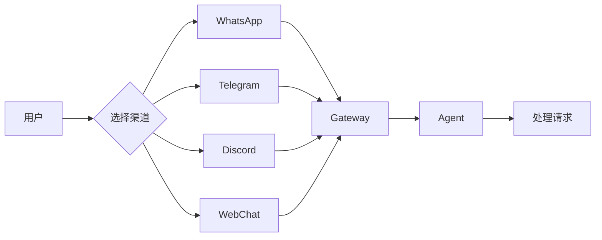
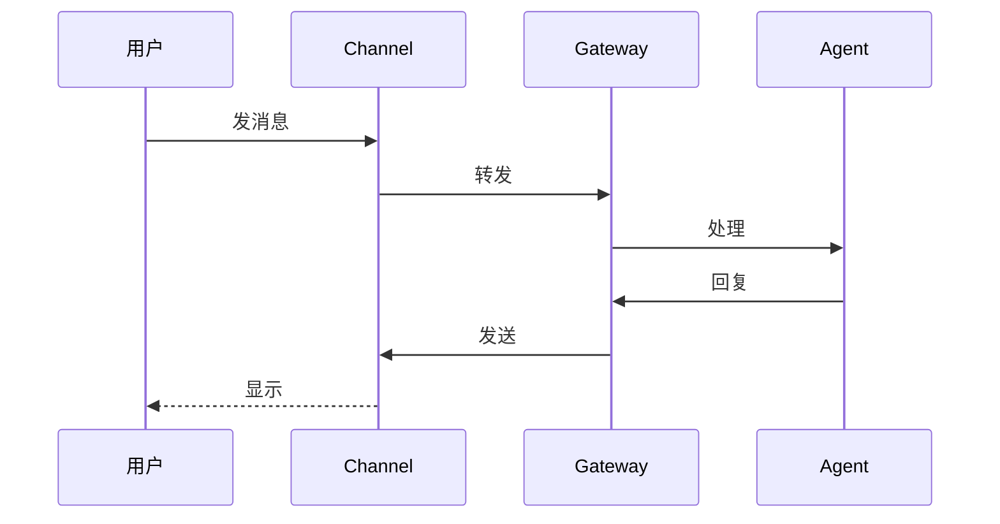

# OpenClaw Channels 通道系统

> Channels 是 Agent 与用户对话的"桥梁"。

---

## 第一步：概念解释

### 什么是 Channel？

**用最简单的话说：** Channel 是一个"通信通道"，让 Agent 能在各种聊天平台上和你对话。

就像你有多个电话号码：
- WhatsApp 号码 → WhatsApp Channel
- Telegram 账号 → Telegram Channel
- Discord 账号 → Discord Channel

**OpenClaw 把这些号码统一管理。**

### Channel 类型

| 类型 | 说明 | 示例 |
|------|------|------|
| **内置通道** | 核心功能，默认支持 | Telegram, WhatsApp, Discord |
| **插件通道** | 需要额外安装 | Matrix, Zalo, LINE |
| **WebChat** | 浏览器聊天 | 内置 |
| **Voice Call** | 电话通话 | 需要插件 |

---

## 第二步：类比理解

### 把 Channels 想象成"客服热线"



| 类比 | 实际 |
|------|------|
| **客服热线** | Channel 通道 |
| **电话号码** | Bot Token / Account |
| **接线员** | Gateway |
| **客服** | Agent |
| **客户** | 用户 |

---

## 第三步：实践示例

### 支持的聊天平台

| 平台 | 设置难度 | 推荐指数 | 说明 |
|------|---------|---------|------|
| **Telegram** | ⭐ 最简单 | ⭐⭐⭐ | 只需 Bot Token |
| **WhatsApp** | ⭐⭐ 中等 | ⭐⭐⭐ | 需要扫码配对 |
| **Discord** | ⭐⭐ 中等 | ⭐⭐⭐ | Bot + Guild 配置 |
| **WebChat** | ⭐ 最简单 | ⭐⭐⭐ | 浏览器直接用 |
| **Signal** | ⭐⭐⭐ 较难 | ⭐⭐ | 需要 signal-cli |
| **iMessage** | ⭐⭐⭐ 较难 | ⭐⭐ | 需要 macOS |
| **Matrix** | ⭐⭐ 中等 | ⭐⭐ | 插件支持 |

---

### 快速设置 Telegram

**步骤：**

1. 找 @BotFather 创建 Bot
2. 获取 Bot Token（如 `123:abc`）
3. 配置：

```bash
openclaw config set channels.telegram.enabled true
openclaw config set channels.telegram.botToken "123:abc"
```

### 快速设置 WhatsApp

**步骤：**

1. 配置启用：

```json5
{
  channels: {
    whatsapp: {
      enabled: true,
    },
  },
}
```

2. 扫码配对：

```bash
openclaw pairing whatsapp
```

### 快速设置 Discord

**步骤：**

1. 创建 Discord Bot（Developer Portal）
2. 获取 Bot Token
3. 邀请 Bot 到服务器
4. 配置：

```json5
{
  channels: {
    discord: {
      enabled: true,
      botToken: "your_token",
      guilds: ["your_guild_id"],
    },
  },
}
```

---

### 访问控制（安全）

| 策略 | 说明 | 配置 |
|------|------|------|
| **pairing** | 新用户需配对码 | `dmPolicy: "pairing"` |
| **allowlist** | 只允许列表用户 | `dmPolicy: "allowlist"` |
| **open** | 允许所有人 | `dmPolicy: "open"` |
| **disabled** | 禁止 DM | `dmPolicy: "disabled"` |

**配置示例：**

```json5
{
  channels: {
    telegram: {
      dmPolicy: "pairing",  // 新用户需要批准
    },
    whatsapp: {
      dmPolicy: "allowlist",
      allowFrom: ["+15555550123"],  // 只允许这个号码
    },
  },
}
```

---

### 群聊设置

**默认：群聊需要 @提及**

```json5
{
  channels: {
    whatsapp: {
      groups: {
        "*": { requireMention: true },  // 所有群都需要提及
        "work-group": { requireMention: false },  // 特定群不需要
      },
    },
  },
  agents: {
    list: [{
      id: "main",
      groupChat: {
        mentionPatterns: ["@openclaw", "openclaw"],  // 匹配模式
      },
    }],
  },
}
```

---

## 第四步：知识关联

### Channel 与 Gateway 的关系



### Channel 状态检查

```bash
# 查看所有 Channel 状态
openclaw channels status

# 深度检查（探测连接）
openclaw channels status --probe
```

---

### 多 Channel 同时运行

**特点：** 一个 Gateway 可以同时连接多个 Channel

```json5
{
  channels: {
    telegram: { enabled: true, botToken: "..." },
    whatsapp: { enabled: true },
    discord: { enabled: true, botToken: "..." },
  },
}
```

**好处：**
- 手机用 WhatsApp 聊
- 电脑用 Discord 聊
- 浏览器用 WebChat 聊
- **同一个 Agent，无缝切换！**

---

## Channel 特性对比

| 特性 | Telegram | WhatsApp | Discord | WebChat |
|------|----------|----------|---------|---------|
| **私聊** | ✅ | ✅ | ✅ | ✅ |
| **群聊** | ✅ | ✅ | ✅ | ❌ |
| **图片** | ✅ | ✅ | ✅ | ✅ |
| **语音** | ✅ | ✅ | ✅ | ✅ |
| **反应** | ✅ | ✅ | ✅ | ❌ |
| **编辑** | ✅ | ✅ | ✅ | ❌ |
| **需要手机** | ❌ | ✅ | ❌ | ❌ |

---

## 常见问题

### Q1: Channel 连不上？

**检查步骤：**

```bash
# 1. 查看 Gateway 状态
openclaw gateway status

# 2. 查看 Channel 状态
openclaw channels status --probe

# 3. 查看日志
openclaw logs --follow
```

### Q2: 群聊里 Agent 不回复？

**原因：** 默认需要 @提及

**解决：**
```json5
{
  channels: {
    whatsapp: {
      groups: { "*": { requireMention: false } },
    },
  },
}
```

### Q3: 如何切换 Channel？

**不需要切换！** 所有 Channel 共享同一个 Agent，会话自动路由。

### Q4: 如何查看配对状态？

```bash
# 查看已配对用户
openclaw pairing list
```

---

## 更多 Channel 详情

| Channel | 详细文档 |
|---------|---------|
| Telegram | https://docs.openclaw.ai/channels/telegram |
| WhatsApp | https://docs.openclaw.ai/channels/whatsapp |
| Discord | https://docs.openclaw.ai/channels/discord |
| Signal | https://docs.openclaw.ai/channels/signal |
| iMessage | https://docs.openclaw.ai/channels/bluebubbles |
| Matrix | https://docs.openclaw.ai/channels/matrix |

---

## 下一步

1. ✅ 选择一个 [Channel](https://docs.openclaw.ai/channels) 开始配置
2. ✅ 阅读 [安全设置](https://docs.openclaw.ai/gateway/security)
3. ✅ 了解 [Gateway 运维](./06-Gateway网关.md)

---

> 最后更新：2026-04-10 | 来源：https://docs.openclaw.ai/channels