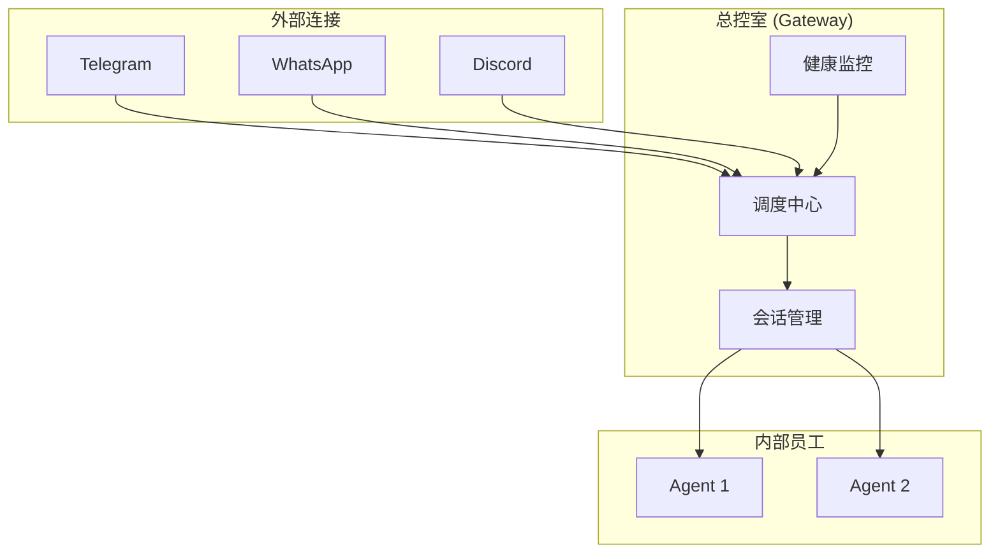
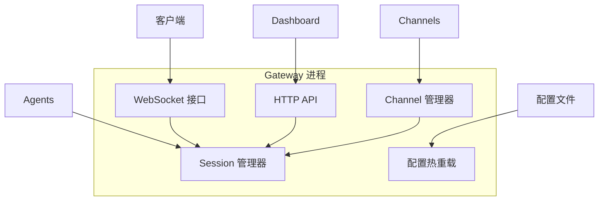
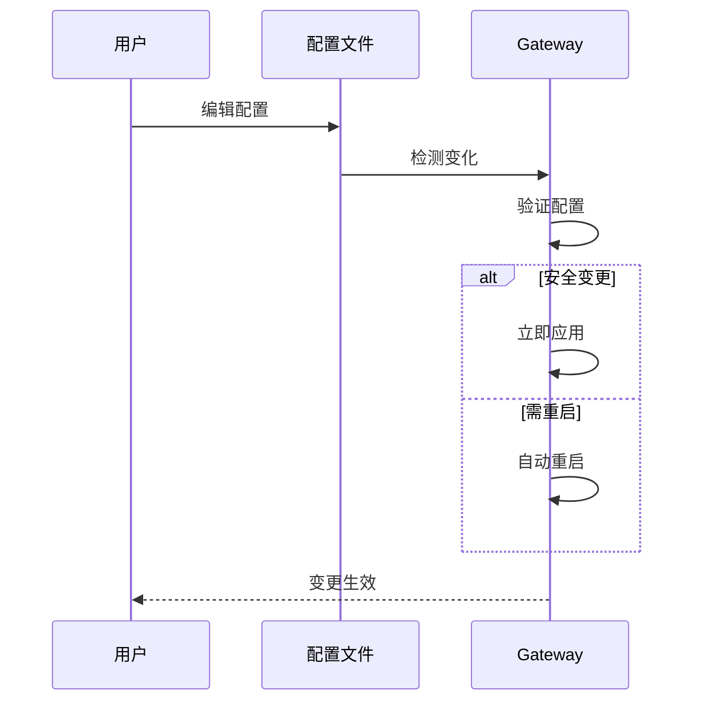

# OpenClaw Gateway 网关运维

> Gateway 是 OpenClaw 的"心脏"，管理所有 Agent 和 Channel。

---

## 第一步：概念解释

### 什么是 Gateway？

**用最简单的话说：** Gateway 是一个"后台服务"，负责：
- 连接所有聊天平台
- 管理所有 Agent 会话
- 处理用户消息路由
- 提供控制接口

**就像公司的总控室：**
- 所有电话都打到总控室
- 总控室分配给合适的客服
- 客服处理后通过总控室回复

### Gateway 核心功能

| 功能 | 说明 | 类比 |
|------|------|------|
| **Channel 管理** | 连接聊天平台 | 接线员 |
| **Session 管理** | 管理 Agent 会话 | 会议调度 |
| **消息路由** | 分发消息 | 邮件分拣 |
| **健康监控** | 监控运行状态 | 医生 |
| **控制 API** | 提供 HTTP/WebSocket 接口 | 窗口服务 |

---

## 第二步：类比理解

### 把 Gateway 想象成"公司总控室"



| 类比 | Gateway 功能 |
|------|------------|
| **接线员** | 接收各平台消息 |
| **调度员** | 分配给合适 Agent |
| **记录员** | 保存会话状态 |
| **监控员** | 检查系统健康 |
| **管理员** | 提供控制接口 |

---

## 第三步：实践示例

### 启动 Gateway

**前台运行（测试）：**

```bash
openclaw gateway --port 18789

# 带详细日志
openclaw gateway --port 18789 --verbose
```

**后台服务（推荐）：**

```bash
# 安装为系统服务
openclaw gateway install

# 查看状态
openclaw gateway status

# 重启
openclaw gateway restart

# 停止
openclaw gateway stop
```

---

### Gateway 状态检查

```bash
# 基本状态
openclaw gateway status

# 输出：
# Runtime: running
# RPC probe: ok
# Port: 18789

# 深度检查（包含系统服务）
openclaw gateway status --deep

# JSON 格式
openclaw gateway status --json
```

---

### Gateway 常用命令

| 命令 | 功能 | 使用场景 |
|------|------|---------|
| `gateway status` | 查看状态 | 检查是否运行 |
| `gateway install` | 安装服务 | 生产部署 |
| `gateway restart` | 重启服务 | 更新后 |
| `gateway stop` | 停止服务 | 维护时 |
| `health` | 健康检查 | 诊断问题 |
| `doctor` | 全面诊断 | 故障排查 |

---

### Gateway 配置

**核心配置项：**

```json5
{
  gateway: {
    port: 18789,               // 监听端口
    bind: "loopback",          // 绑定模式
    
    auth: {
      token: "your_token",     // 认证令牌
      password: "your_pass",   // 认证密码
      mode: "shared-secret",   // 认证模式
    },
    
    reload: {
      mode: "hybrid",          // 配置重载模式
      debounceMs: 300,         // 防抖延迟
    },
    
    channelHealthCheckMinutes: 5,  // 健康检查间隔
  },
}
```

---

### 系统服务管理

**macOS (launchd)：**

```bash
openclaw gateway install  # 创建 LaunchAgent
openclaw gateway status   # 查看状态
```

**Linux (systemd)：**

```bash
# 用户服务
openclaw gateway install
systemctl --user enable --now openclaw-gateway.service

# 系统服务
sudo systemctl enable --now openclaw-gateway.service
```

**Windows (Scheduled Task)：**

```powershell
openclaw gateway install
openclaw gateway status --json
```

---

## 第四步：知识关联

### Gateway 架构图



### Gateway 端口功能

**单端口多功能：**

| 功能 | 路径 | 说明 |
|------|------|------|
| WebSocket RPC | `/` | 客户端连接 |
| OpenAI API | `/v1/*` | 兼容接口 |
| Control UI | `/` | Dashboard |
| Hooks | `/hooks` | Webhook |

---

### 配置热重载



**变更类型：**

| 类型 | 是否重启 | 示例 |
|------|---------|------|
| Channel 配置 | ❌ 不重启 | `channels.telegram.*` |
| Agent 配置 | ❌ 不重启 | `agents.defaults.*` |
| Session 配置 | ❌ 不重启 | `session.*` |
| Gateway 配置 | ✅ 需重启 | `gateway.port` |

---

### 健康监控

**检查命令：**

```bash
# Gateway 健康状态
openclaw health

# Channel 状态
openclaw channels status --probe

# 全面诊断
openclaw doctor
```

**监控指标：**

| 指标 | 说明 | 正常值 |
|------|------|--------|
| `Runtime` | 运行状态 | `running` |
| `RPC probe` | RPC 可用 | `ok` |
| `Port` | 监听端口 | `18789` |
| `Uptime` | 运行时间 | > 0 |

---

## 常见故障处理

### Gateway 启动失败

| 错误信息 | 原因 | 解决方法 |
|---------|------|---------|
| `EADDRINUSE` | 端口占用 | 改端口或 `--force` |
| `refusing to bind without auth` | 非本地绑定无认证 | 配置 auth |
| `config validation failed` | 配置错误 | `openclaw doctor --fix` |

**诊断流程：**

```bash
# 1. 运行诊断
openclaw doctor

# 2. 查看日志
openclaw logs --follow

# 3. 检查配置
openclaw config get gateway
```

---

### 多 Gateway 场景

**何时需要多个 Gateway？**
- 严格隔离（home/work）
- 备用/救援 Gateway
- 不同端口需求

**配置要点：**

```bash
# 端口隔离
Gateway A: port 18789
Gateway B: port 19001

# 配置隔离
OPENCLAW_CONFIG_PATH=~/.openclaw/a.json
OPENCLAW_CONFIG_PATH=~/.openclaw/b.json
```

---

### 远程访问

**推荐方式：Tailscale**

```bash
# 配置 Tailscale
tailscale up

# 访问
wss://100.x.y.z:18789
```

**备用方式：SSH 隧道**

```bash
ssh -N -L 18789:127.0.0.1:18789 user@host

# 本地访问
ws://127.0.0.1:18789
```

---

## 常见问题

### Q1: Gateway 状态显示 not running？

**检查：**

```bash
# 查看服务状态
openclaw gateway status --deep

# 手动启动
openclaw gateway --port 18789

# 查看日志
openclaw logs --follow
```

### Q2: 配置修改后没生效？

**检查热重载模式：**

```bash
openclaw config get gateway.reload.mode
```

| 模式 | 行为 |
|------|------|
| `hybrid` | 安全变更自动生效，其他自动重启 |
| `hot` | 只生效安全变更，需手动重启其他 |
| `off` | 完全手动重启 |

### Q3: 如何查看 Gateway 日志？

```bash
# 实时日志
openclaw logs --follow

# 指定行数
openclaw logs --lines 100
```

---

## OpenAI 兼容 API

Gateway 提供兼容 OpenAI 的 HTTP API：

| 端点 | 功能 | 说明 |
|------|------|------|
| `GET /v1/models` | 模型列表 | 返回 Agent 列表 |
| `POST /v1/chat/completions` | 聊天补全 | 标准接口 |
| `POST /v1/responses` | Responses API | Agent-native |

**用途：** 可接入 OpenWebUI、LobeChat、LibreChat 等前端。

---

## 下一步

1. ✅ 阅读 [故障排查](https://docs.openclaw.ai/gateway/troubleshooting)
2. ✅ 了解 [远程访问](https://docs.openclaw.ai/gateway/remote)
3. ✅ 配置 [安全认证](https://docs.openclaw.ai/gateway/authentication)

---

> 最后更新：2026-04-10 | 来源：https://docs.openclaw.ai/gateway