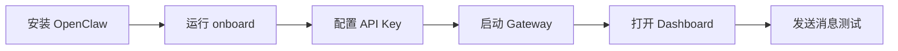
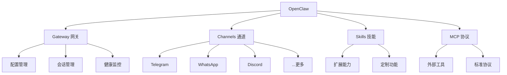

# OpenClaw 官方文档

> 本文档基于 OpenClaw 官方文档整理，使用费曼学习法组织内容。

---

## 第一步：概念解释

### 什么是 OpenClaw？

**用最简单的话说：** OpenClaw 是一个"翻译器"，它把你在各种聊天软件（Discord、Telegram、WhatsApp 等）说的话，翻译给 AI Agent，再把 AI 的回复翻译回聊天软件。

就像你雇了一个秘书，你可以在任何地方给他发消息（手机上的 WhatsApp、电脑上的 Discord），他都会帮你处理。

### 核心组成部分

| 组成部分 | 作用 | 类比 |
|---------|------|------|
| **Gateway** | 大脑中枢，协调一切 | 公司总部 |
| **Channel** | 连接各种聊天平台 | 分公司/办事处 |
| **Agent** | 实际干活的人 | 员工 |
| **Node** | 手机/电脑上的 App | 员工的手机 |

---

## 第二步：类比理解

### 把 OpenClaw 想象成一个"万能客服中心"

**传统客服中心的问题：**
- 每个平台（微信、电话、邮件）需要单独的系统
- 客服人员分散，信息不统一
- 换平台很麻烦

**OpenClaw 的解决方案：**
- 一个 Gateway = 一个总控中心
- 所有聊天平台都连到这里
- AI Agent = 24/7 在线的超级客服
- 你从任何平台发消息，都能得到同样的服务

---

## 第三步：实践示例

### 快速开始（5 分钟）

```bash
# 1. 安装
npm install -g openclaw@latest

# 2. 初始化
openclaw onboard --install-daemon

# 3. 打开控制面板
openclaw dashboard
```

**执行流程图：**



### 三种使用方式

1. **WebChat（浏览器）** - 最简单，直接在浏览器聊天
2. **Channel（聊天平台）** - 连接 Telegram/WhatsApp 等
3. **Node（移动 App）** - iOS/Android 专用功能（相机、语音）

---

## 第四步：知识关联

### 与其他概念的关系



---

## 文档导航

| 文档 | 内容 | 适用场景 |
|------|------|---------|
| [01-安装指南](./01-安装指南.md) | 5 分钟快速安装 | 新手入门 |
| [02-配置指南](./02-配置指南.md) | 配置文件详解 | 定制化设置 |
| [03-Skills技能](./03-Skills技能.md) | 扩展 Agent 能力 | 功能扩展 |
| [04-MCP协议](./04-MCP协议.md) | MCP 协议支持 | 工具集成 |
| [05-Channels通道](./05-Channels通道.md) | 聊天平台支持 | 多平台部署 |
| [06-Gateway网关](./06-Gateway网关.md) | 运维与监控 | 系统管理 |

---

## 关键特性一览

### 🌐 多平台支持

**内置通道：**
- Discord、iMessage、Signal、Slack、Telegram、WhatsApp
- Google Chat、Microsoft Teams、Feishu
- Matrix、Mattermost、IRC、Nostr

**插件通道：**
- Zalo、LINE、Twitch、Tlon、Synology Chat

### 🔧 Agent 能力

| 能力 | 说明 |
|------|------|
| **工具调用** | 执行 shell 命令、文件操作 |
| **网络搜索** | DuckDuckGo、Perplexity 等 |
| **浏览器控制** | 自动化网页操作 |
| **Skills 扩展** | 通过技能文件扩展能力 |
| **MCP 协议** | 标准化工具协议支持 |

### 📱 移动端功能

- **Canvas** - 屏幕共享和协作
- **Camera** - 拍照分析
- **Voice Wake** - 语音唤醒
- **Talk Mode** - 语音对话模式

---

## 常见问题

### Q1: OpenClaw 和直接用 AI API 有什么区别？

| 对比项 | 直接用 API | OpenClaw |
|--------|-----------|----------|
| 访问方式 | 只能通过代码/API | 聊天软件直接对话 |
| 多平台 | 需要自己集成 | 一键连接多个平台 |
| 会话管理 | 手动维护 | 自动管理 |
| 工具调用 | 需要自己开发 | 内置 Skills/MCP |
| 成本 | API 费用 | API 费用（无额外费用） |

### Q2: 需要什么技术基础？

- **最低要求：** 会用命令行，能运行几行命令
- **进阶使用：** 了解 JSON 配置文件
- **高级定制：** 了解 TypeScript/Node.js

### Q3: 数据安全吗？

- **自托管** - 所有数据都在你自己的机器上
- **开源** - MIT 许可，代码完全透明
- **本地存储** - 会话、配置都在本地
- **API 调用** - 只有 AI API 调用会发到外部

---

## 快速链接

- 📚 官方文档: https://docs.openclaw.ai
- 💻 GitHub: https://github.com/openclaw/openclaw
- 💬 社区支持: Discord/Telegram

---

> 最后更新：2026-04-10 | 来源：https://docs.openclaw.ai